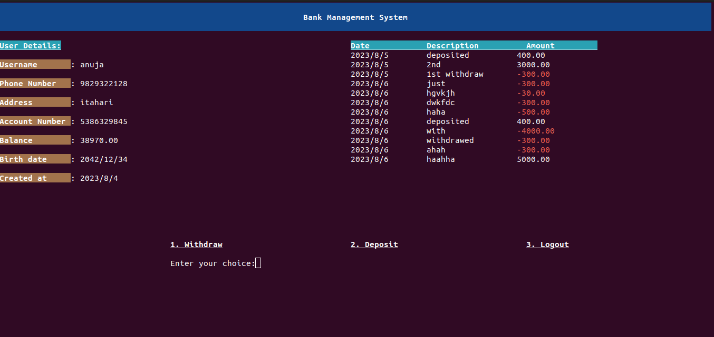

# BANK MANAGEMENT SYSTEM

## This repository contains :
* Log in feature
* Sign Up feature
* Profile feature
  * This feature contains user details and transactions history.
* Withdraw feature
* Deposit feature
* Log out your account

## How do you run this program?
I suggest using gcc compiler, however other compiler works too.
You should use following commands in terminal to run this program successfully:
* ` gcc -o out  main.c utils.c users.c transaction.c` 
    * This command compiles and links the source code files main.c, utils.c, users.c, and transaction.c into an output file named 'out' which is our binary file where the -o flag specifies the output file. The gcc is the GNU Compiler Collection used to compile C programs.

* ` ./out `
    * This commands run the binary file in the current directory that we just created.

## Future Enhancement
* This program doesn't support to transfer money from one account to aother account. 

## Profile page
